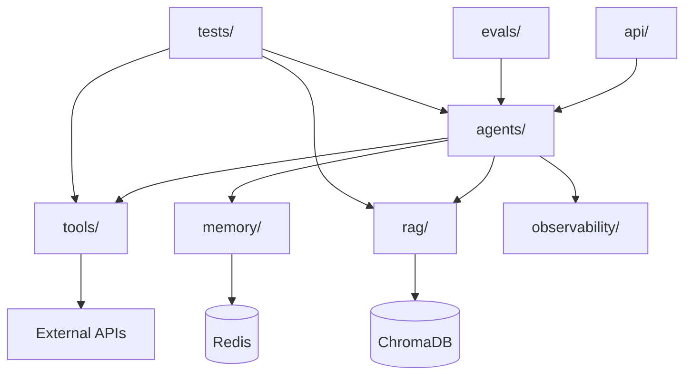

# 系统架构文档

## 1. 整体架构

```
用户请求
    ↓
API Server (FastAPI)
    ↓
Agent Orchestrator
    ↓
┌─────────────────────────────────────┐
│  Planner → Tool Caller → Evaluator  │
└─────────────────────────────────────┘
    ↓           ↓           ↓
  Memory      RAG        Tools
    ↓           ↓           ↓
  Redis     ChromaDB    External APIs
    ↓           ↓           ↓
┌─────────────────────────────────────┐
│         Observability Layer         │
│    (Tracing + Logging + Metrics)    │
└─────────────────────────────────────┘
```

## 2. 数据流

### 2.1 文档上传流程

```
用户上传文件
    ↓
文件格式检测 (PDF/MD)
    ↓
文本提取
    ↓
智能分块 (按段落 + 重叠窗口)
    ↓
生成 Embedding (ChromaDB 默认模型)
    ↓
存入 ChromaDB
    ↓
返回文档元信息
```

### 2.2 问答流程

```
用户提问
    ↓
Agent 接收问题 + 历史上下文
    ↓
Claude API 调用 (带工具定义)
    ↓
┌─ Claude 返回 tool_use ──────────────┐
│                                     │
│  执行对应工具                        │
│  ↓                                  │
│  将工具结果发回 Claude               │
│  ↓                                  │
│  循环直到 Claude 返回最终回答        │
└─────────────────────────────────────┘
    ↓
保存对话历史
    ↓
返回回答 + 来源引用 + Trace
```

## 3. 模块依赖关系



## 4. 技术选型对比

### 4.1 向量数据库

| 方案 | 优点 | 缺点 | 选择 |
|------|------|------|------|
| ChromaDB | 本地部署、Python 原生、无需外部依赖 | 性能一般、不适合大规模 | ✅ MVP 阶段 |
| Pinecone | 托管服务、性能好 | 付费、依赖外部服务 | ❌ |
| Weaviate | 功能丰富、支持混合搜索 | 部署复杂 | ❌ 后续考虑 |
| Milvus | 高性能、可扩展 | 部署复杂、资源消耗大 | ❌ |

**决策：** MVP 阶段用 ChromaDB，后续如果需要性能再考虑 Milvus。

### 4.2 Embedding 模型

| 方案 | 维度 | 性能 | 本地运行 | 选择 |
|------|------|------|----------|------|
| all-MiniLM-L6-v2 | 384 | 中等 | ✅ | ✅ ChromaDB 默认 |
| text-embedding-ada-002 | 1536 | 好 | ❌ (需 API) | ❌ |
| BGE-large | 1024 | 好 | ✅ | ❌ 后续考虑 |

**决策：** 先用 ChromaDB 默认模型，够用且无需额外配置。

### 4.3 Agent 框架

| 方案 | 优点 | 缺点 | 选择 |
|------|------|------|------|
| 自研 Agent Loop | 完全可控、理解底层原理 | 开发量大 | ✅ |
| LangChain | 生态丰富、开箱即用 | 抽象层厚、难调试 | ❌ |
| LlamaIndex | RAG 专长 | Agent 能力弱 | ❌ |

**决策：** 自研 Agent Loop，展示对 Agent 原理的理解，面试加分。

## 5. 关键设计决策

### 5.1 为什么用单 Agent 而不是多 Agent?

- MVP 阶段需求简单，单 Agent 足够
- 多 Agent 增加协调复杂度
- 后续可以扩展为 Planner + Executor + Critic 模式

### 5.2 为什么用内存存储对话历史?

- MVP 阶段快速验证
- 无需额外依赖
- 后续可换 Redis/PostgreSQL

### 5.3 为什么自研而不 LangChain?

- 面试需要展示对底层原理的理解
- 自研代码更易调试和优化
- 避免 LangChain 的抽象层带来的性能损耗

## 6. 扩展性设计

```
当前 (MVP)
├── 单 Agent
├── 本地 ChromaDB
├── 内存对话存储
└── 基础 Tracing

后续扩展
├── 多 Agent (Planner + Executor + Critic)
├── 分布式向量数据库 (Milvus)
├── 持久化存储 (Redis/PostgreSQL)
├── 完整 Observability (OpenTelemetry)
└── 评测系统 (自动化 + 人工)
```

## 7. 性能目标

| 指标 | 目标 | 测量方式 |
|------|------|----------|
| 简单问答响应时间 | < 2s | API 响应时间 |
| 复杂问答响应时间 | < 5s | API 响应时间 |
| 文档处理速度 | < 10s/文档 | 上传到索引完成 |
| 检索准确率 | > 80% | 人工评测 |
| 工具调用准确率 | > 90% | 自动化评测 |
