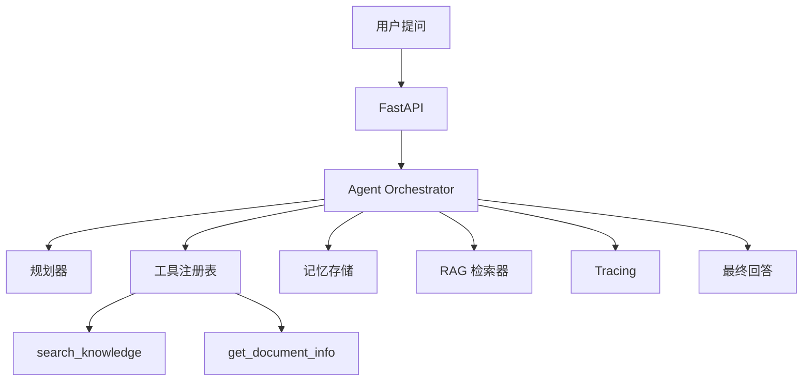

# Knowledge Agent - 个人知识库问答 Agent

基于 RAG + Tool Use 的智能文档助手，支持文档上传、语义检索、多轮对话。

## 项目特性

- 文档上传与智能分块
- 语义检索 (ChromaDB)
- Claude Tool Use 多步推理
- 多轮对话上下文记忆
- 完整 Trace 记录
- Prompt Injection 防护

## 技术栈

- Python 3.11+
- Claude API (anthropic SDK)
- ChromaDB (向量数据库)
- FastAPI (Web API)

## 快速开始

```bash
# 安装依赖
pip install -r requirements.txt

# 配置环境变量
cp .env.example .env
# 编辑 .env 填入 ANTHROPIC_API_KEY

# 启动服务
python main.py
```

## 项目结构

```
knowledge-agent/
├── ARCHITECTURE.md      # 系统架构文档
├── AGENT_DESIGN.md      # Agent 设计文档
├── TOOLS.md             # 工具协议文档
├── EVAL_PLAN.md         # 评测方案
├── SECURITY.md          # 安全设计
├── ERROR_HANDLING.md    # 失败处理策略
├── DEV_SPEC.md          # 开发规范
├── PRD.md               # 产品需求文档
├── DEMO.md              # 演示脚本
├── INTERVIEW_QA.md      # 面试问答准备
├── prompts/             # Prompt 版本管理
├── src/                 # 源代码
│   ├── agents/          # Agent 模块
│   ├── tools/           # 工具实现
│   ├── rag/             # RAG 模块
│   ├── memory/          # 记忆模块
│   ├── evals/           # 评测模块
│   ├── observability/   # 可观测性
│   └── api/             # API 路由
├── evals/               # 评测数据集和报告
├── tests/               # 测试文件
└── scripts/             # 脚本工具
```

## Agent 工作流程



## 为什么用 Agent 而不是普通 Chatbot?

普通 Chatbot 只做对话生成，我的 Agent 能：
- 动态决定是否调用工具
- 多步推理定位问题
- 记录完整执行 Trace
- 失败时自动重试或降级
- 控制工具调用边界和权限

## License

MIT
