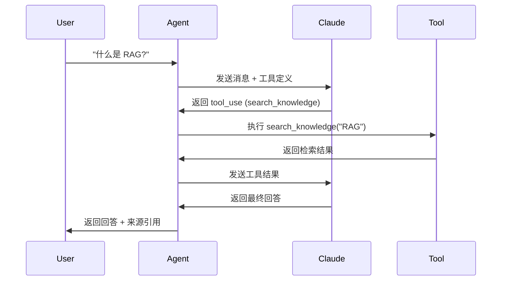

# 工具协议文档

## 工具注册表

### 1. search_knowledge

**用途：** 搜索知识库中的相关文档片段

**输入：**
```yaml
query: string (required)
  description: 搜索查询
  example: "什么是 RAG?"

top_k: integer (optional, default=5)
  description: 返回结果数量
  min: 1
  max: 20
```

**输出：**
```yaml
results:
  - chunk_id: string
    doc_id: string
    filename: string
    content: string
    relevance_score: float (0-1)
    metadata:
      page: integer (可选)
      section: string (可选)
total_results: integer
```

**失败情况：**
| 错误码 | 描述 | 处理方式 |
|--------|------|----------|
| EMPTY_RESULT | 未找到相关结果 | 尝试不同查询词或告知用户 |
| DB_NOT_CONNECTED | 数据库未连接 | 返回系统错误，记录 Trace |
| TIMEOUT | 查询超时 | 重试 1 次，失败返回错误 |

**权限边界：**
- 只读访问
- 不能修改或删除文档

---

### 2. get_document_info

**用途：** 获取指定文档的详细信息

**输入：**
```yaml
doc_id: string (required)
  description: 文档 ID
  example: "doc_abc123"
```

**输出：**
```yaml
doc_id: string
filename: string
file_type: string (pdf | markdown)
chunks_count: integer
created_at: datetime
metadata: object
```

**失败情况：**
| 错误码 | 描述 | 处理方式 |
|--------|------|----------|
| DOCUMENT_NOT_FOUND | 文档不存在 | 告知用户文档未找到 |
| DB_ERROR | 数据库错误 | 返回系统错误，记录 Trace |

**权限边界：**
- 只读访问
- 只能查看元信息，不能查看文档内容

---

## 工具调用示例

### 正常调用

```json
// Claude 返回
{
  "type": "tool_use",
  "id": "toolu_01abc123",
  "name": "search_knowledge",
  "input": {
    "query": "什么是 RAG?",
    "top_k": 3
  }
}

// 执行工具后返回
{
  "type": "tool_result",
  "tool_use_id": "toolu_01abc123",
  "content": [
    {
      "chunk_id": "chunk_001",
      "doc_id": "doc_abc",
      "filename": "rag_intro.pdf",
      "content": "RAG (Retrieval-Augmented Generation) 是一种...",
      "relevance_score": 0.92
    }
  ]
}
```

### 工具调用流程



---

## 工具开发规范

### 1. 工具定义格式

```python
TOOLS = [
    {
        "name": "tool_name",
        "description": "工具描述，告诉 Claude 什么时候用这个工具",
        "input_schema": {
            "type": "object",
            "properties": {
                "param1": {
                    "type": "string",
                    "description": "参数描述"
                }
            },
            "required": ["param1"]
        }
    }
]
```

### 2. 工具执行函数

```python
def execute_tool(tool_name: str, tool_input: dict) -> dict:
    """
    执行工具并返回结果

    Args:
        tool_name: 工具名称
        tool_input: 工具输入参数

    Returns:
        工具执行结果

    Raises:
        ToolNotFoundError: 工具不存在
        ToolExecutionError: 工具执行失败
    """
    pass
```

### 3. 工具结果格式

```python
# 成功
{
    "success": True,
    "data": { ... }
}

# 失败
{
    "success": False,
    "error": {
        "code": "ERROR_CODE",
        "message": "错误描述"
    }
}
```

---

## 新增工具 Checklist

- [ ] 定义工具 Schema (name, description, input_schema)
- [ ] 实现工具执行函数
- [ ] 添加错误处理
- [ ] 编写单元测试
- [ ] 更新本文档
- [ ] 添加到 Trace 记录
